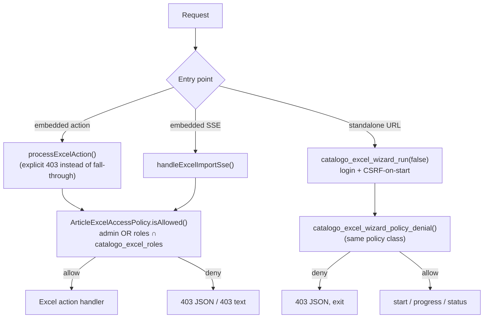
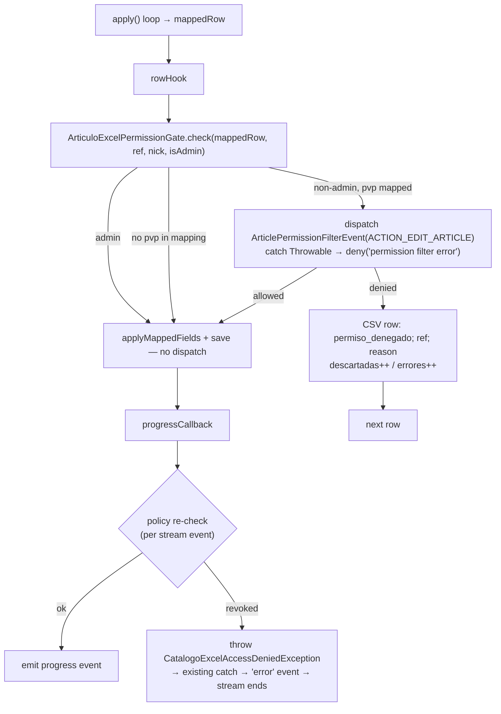

# Design: Catalogo Excel Access Control (admin-only default, role-based grants)

## Technical Approach

One policy service (`Services/ArticleExcelAccessPolicy.php`) becomes the single verdict source — `admin OR (non-admin AND roles ∩ catalogo_excel_roles)` — consumed by both bootstrap paths: the embedded `VentasArticulos` controller and the standalone `process_excel_wizard_dispatch.php`. A second service (`ArticuloExcelPermissionGate`) centralizes the per-row `ArticlePermissionFilterEvent` dispatch for `pvp`-mapped rows with fail-closed semantics. Denied rows are skipped and reported through the existing discarded-rows CSV. Settings are persisted via `fs_settings` under key `catalogo_excel_roles` (comma-separated `codrol`), managed from a dedicated admin-only page following the tpvmod precedent. Implements the binding delta specs: `articulos-excel-import-export` (R-CEXC-001/003/004/005/007) and `articulos-excel-access-settings` (R-CEXC-002/006 + settings page).

Verified current-state facts this design builds on:
- Tautological gate: `Controller/VentasArticulos.php:99-103` (`admin || have_access_to('ventas_articulos')`); `processExcelAction()` returns `false` when denied (`:106-112`) → **silent fall-through** to list render, not an explicit denial.
- Standalone hole: `process_excel_wizard_dispatch.php:41-79` checks action presence, CSRF-on-`start`, login — no policy check.
- Import path writes `pvp` with zero filter dispatch: rowHook → `catalogoApplyWizardFields()` (`dispatch:381-401`) → `ArticuloExcelRowUpdater::applyMappedFields` pvp case (`Services/ArticuloExcelRowUpdater.php:171-175`); create path sets pvp in `createArticuloFromRow` (`Services/ArticuloExcelImportWizardService.php:238-244`). `applyMapping` drops empty cells (`:296-299`), so **`isset($mappedRow['pvp'])` ⇒ the row writes pvp**.
- Frozen event: `Event/ArticlePermissionFilterEvent.php:36-38` (`NAME`, `ACTION_EDIT_ARTICLE`), default-allow, `deny(reason)`, `getDenialReason()`. Existing dispatch+fail-closed pattern to replicate: `Controller/VentasArticulo.php:208-217`.
- Discarded-rows CSV exists: created with header `motivo_descarte;referencia;detalle` (`dispatch:217-235`), served by `download_import_log` (`Controller/VentasArticulos.php:307-330`).
- `fs_settings::get/set` are pure `$GLOBALS['config2']` array ops (`base/fs_settings.php:43-60`), `save()` at `:264`. `fs_rol_user::all_from_user($nick)` (`model/fs_rol_user.php:101`); `fs_roles` via `fs_rol` (`model/fs_rol.php:28-35`). Session nick outside controllers: `SessionManager::getCurrentUserNick()` (`src/Security/SessionManager.php:478`).

## Architecture Decisions

### Decision 1: Policy service shape — instantiated final class, lazy wiring, no DI

**Choice**: `final class ArticleExcelAccessPolicy` (no-arg constructor, instance methods, lazy `require_once` model wiring like tarifario's `ArticlePermissionListener`). Both bootstrap paths do `new ArticleExcelAccessPolicy()`; the standalone dispatch (plain procedural include) calls it from a new pure function — no controller or container needed.
**Alternatives**: static pure functions (rejected: needs static memo state → test pollution and cross-request staleness risk, or repeated reads); DI container service (rejected: plugin has no `config/services.php` today — verified; direct instantiation is the dominant Service pattern, e.g. `new ArticuloExcelExportService()`).
**Rationale**: instance lifetime in PHP-FPM == request lifetime, which gives per-request caching for free (Decision 3); lazy wiring + `@internal` test setters mirror the proven `ArticlePermissionListener` pattern (`plugins/tarifario/Services/ArticlePermissionListener.php:84-117`); both entry points share one rule with zero drift.

### Decision 2: Import action constant — reuse frozen `ACTION_EDIT_ARTICLE`

**Choice**: per-row import dispatches use `ArticlePermissionFilterEvent::ACTION_EDIT_ARTICLE`; **no new constant**.
**Alternatives**: new `ACTION_IMPORT_ARTICLE` on the host event class.
**Rationale**: (a) tarifario's listener does **not** switch on action — it resolves the matrix from `nick` + `referencia` over active tarifas (`ArticlePermissionListener.php:48-75`), so both options are behaviorally identical today; (b) semantically an imported `pvp` write **is** an edit of the article's price; (c) a new constant invites fail-open drift: a future listener gating `edit_article` but not `import_article` would let imports bypass it. Reuse keeps the fail-closed surface minimal and is semantically honest.

### Decision 3: Role-set caching — per-instance memoization

**Choice**: the policy memoizes (nick → verdict) and (granted roles) per instance; controller holds one instance per request, the dispatch file creates one per import run. Cross-request staleness is impossible because instance lifetime == request.
**Alternatives**: static/global cache (rejected: staleness risk, test reset burden); re-evaluate per call (rejected: `fs_rol_user::all_from_user` is a DB SELECT per call — thousands of SSE progress events × 1 query each is real load).
**Rationale**: matches the proposal's tradeoff note ("per-request caching of the role set, single query"); cost of a cache miss is one indexed SELECT + one `fs_roles` read, paid once per request.

### Decision 4: Unauthorized response shape per surface (explicit, never silent)

| Surface | Client | Denied response |
|---|---|---|
| `preview_excel`, `get_preview` | fetch, parses `json.error` (wizard.js:180,219) | HTTP 403 + JSON `{success:false, error:...}` |
| `export_excel`, `export_excel_filtered`, `export_excel_template` | link navigation | HTTP 403 + short text body (mirrors existing 404 pattern in `downloadImportLog`) |
| `download_import_log` | link navigation | HTTP 403 + text body |
| `excel_import_sse` (stream start) | EventSource onerror parses body JSON (wizard.js:585-591) | HTTP 403 + JSON (same shape as existing CSRF denial, `VentasArticulos.php:175-181`) |
| SSE mid-stream (embedded & standalone) | SSE `error` event | `error` event with denial message, stream terminates, no further processing |
| Standalone `start`/`progress`/`status` | fetch/EventSource | HTTP 403 + JSON `{success:false, error:...}` (spec-mandated; client already handles it) |
| Settings page | browser | framework `access_denied` render (fs_controller admin gate) — sufficient per spec |

**Rationale**: every shape is what the existing client already parses — no wizard JS changes; the silent fall-through at `processExcelAction()` is replaced by explicit denials for all known Excel actions.

### Decision 5: Admin dominance in the per-row filter — skip dispatch for admins

**Choice**: `ArticuloExcelPermissionGate::check()` returns "allow" immediately (no event constructed, no dispatch) when the importing user is admin.
**Alternatives**: dispatch and rely on the admin path (tarifario's listener does have its own admin bypass, `ArticlePermissionListener.php:77-81`, but outcome would then depend on listener correctness).
**Rationale**: the spec pins the outcome "never denied by this filter, **regardless of listeners**" — only skip-dispatch guarantees that by construction. The event is a host-internal contract (`catalogo_core`), so reduced dispatch count for admins is not an observable API change. Verify-phase tests assert the outcome (admin rows never skipped with a permission reason).

### Decision 6: Setting storage + validation — `catalogo_excel_roles`, comma list, whitelist at save, intersect at read

**Choice**: key `catalogo_excel_roles` via `fs_settings` (INI-safe scalar; JSON arrays in INI are fragile). Save: split on `,`, trim, drop empties, validate each `codrol` against existing `fs_roles`, dedupe, preserve order, implode `,`, `set()` + `save()`. Read (`grantedRoles()`): parse comma list; **intersect with `fs_roles`** (deleted-role edge → not granted); absent or unparsable value → `[]` (fail-closed, admin-only). Unknown `codrols` are ignored at read time even if somehow persisted.
**Alternatives**: JSON-encoded array (rejected: INI quoting fragility); save-time whitelist only (rejected: spec requires validation "at evaluation time" — roles can be deleted after saving).

### Decision 7: Settings UI home — dedicated legacy controller page, NOT PageController

**Choice**: `controller/catalogo_excel_settings.php` extending legacy `fs_controller` with `parent::__construct(__CLASS__, 'Excel import/export access', 'admin', TRUE, TRUE)` — exact tpvmod precedent (`plugins/tpvmod/controller/tpvmod_settings.php:48-50`); view `view/catalogo_excel_settings.html.twig` (both `view/` and `View/` plugin dirs are registered in the Twig loader, `src/Core/Html.php:191-207`). Page shows the current policy summary (admin always allowed + granted roles with `descripcion`) and a checkbox multi-select of `fs_roles`; POST is CSRF-checked (`isCsrfValid()`), input-whitelisted to the single `catalogo_excel_roles` field.
**Alternatives**: page name inside `ventas_articulos` (rejected in proposal: surprising placement); `PageController` (rejected: its gate is `admin || have_access_to(page)` — `src/Core/Base/Controller.php:184-190` — the same tautology class this change removes; non-admins with an `fs_access` row could reach it).
**Rationale**: `fs_controller`'s `(folder='admin', admin=TRUE, shmenu=TRUE)` args block non-admins at the framework level; tpvmod proves the pattern end-to-end including template resolution.

### Decision 8: Import-log denial reporting — existing discarded-rows CSV

**Choice**: denied rows are written by the rowHook to the existing `catalogo_import_*_descartadas.csv` as `permiso_denegado;<referencia>;<denialReason>` (reason from `getDenialReason()`, or `permission filter error` on listener exception), via the injection-safe `catalogoFputcsvSafe()`; `stats['descartadas']++` and `stats['errores']++`; import continues with remaining rows. The CSV is already served by the (now policy-gated) `download_import_log` and its URL is already in the completion event (`dispatch:289-295`) — no new log infrastructure.
**Alternatives**: new log file/table (rejected: duplicates existing audit path; no new tables per proposal).

## Data Flow

(a) Request → policy verdict → allow/deny per entry point:



(b) Import row loop → pvp write → filter dispatch → skip + log (per-event SSE re-check included):



## File Changes

| File | Action | Description |
|------|--------|-------------|
| `plugins/catalogo_core/Services/ArticleExcelAccessPolicy.php` | Create | Central verdict: `isAllowed(?fs_user)`, `isAdmin()`, `grantedRoles(): list<string>`, `denialMessage()`; per-instance memoization; lazy model wiring; `SETTING_KEY` const |
| `plugins/catalogo_core/Services/ArticuloExcelPermissionGate.php` | Create | Per-row gate: admin skip (Decision 5), `isset($mappedRow['pvp'])` condition, event dispatch with `ACTION_EDIT_ARTICLE`, fail-closed catch; returns denial reason or null |
| `plugins/catalogo_core/Services/CatalogoExcelAccessDeniedException.php` | Create | `RuntimeException` subtype thrown by SSE per-event re-check; message = denial text |
| `plugins/catalogo_core/controller/catalogo_excel_settings.php` | Create | Admin-only settings page (fs_controller, `'admin', TRUE, TRUE`), CSRF + whitelist + `set`/`save` |
| `plugins/catalogo_core/view/catalogo_excel_settings.html.twig` | Create | Policy summary + role checkbox list + save button (`csrf_field()`) |
| `plugins/catalogo_core/Controller/VentasArticulos.php` | Modify | Replace `initImportExportPermissions()` tautology (`:99-103`) with policy verdict (instance kept for reuse); `processExcelAction()` emits explicit 403 JSON/text for known Excel actions when denied |
| `plugins/catalogo_core/process_excel_wizard_dispatch.php` | Modify | New `catalogo_excel_wizard_policy_denial()` (+ emit helper) applied to all standalone actions after login; per-event policy re-check in `progressCallback`/before `complete`; rowHook integrates `ArticuloExcelPermissionGate` before create/update branches |
| `plugins/catalogo_core/View/ventas_articulos.html.twig` | Verify only | Gates already key on `can_import_export` (`:38`, `:190`); expected **0 changed lines** once the flag is the real verdict (R-CEXC-007 satisfied) |
| `plugins/catalogo_core/tests/Services/ArticleExcelAccessPolicyTest.php` | Create | RED tests for R-CEXC-002/006 semantics |
| `plugins/catalogo_core/tests/Services/ArticuloExcelPermissionGateTest.php` | Create | RED tests for R-CEXC-003 row semantics |
| `plugins/catalogo_core/tests/CatalogoExcelWizardAccessTest.php` | Create | RED tests for standalone dispatch denial + per-event re-check behavior |
| `plugins/catalogo_core/tests/CatalogoExcelSettingsPageTest.php` | Create | RED tests for settings persistence, whitelist, CSRF, naming grep-audit |
| `plugins/tarifario/tests/Integration/ArticlePermissionListenerImportContextTest.php` | Create | Root-suite composition test: real listener × import-context event (Decision 2) |

## Interfaces / Contracts

```php
// Services/ArticleExcelAccessPolicy.php
final class ArticleExcelAccessPolicy
{
    public const SETTING_KEY = 'catalogo_excel_roles';
    /** Verdict for $user (or session user when null). Memoized per instance+nick. */
    public function isAllowed(?\fs_user $user = null): bool;   // admin OR granted
    public function isAdmin(?\fs_user $user = null): bool;
    /** @return list<string> parsed comma list ∩ fs_roles (fail-closed: absent/unparsable ⇒ []) */
    public function grantedRoles(): array;
    public function denialMessage(): string;                   // user-facing Spanish, matches plugin convention
    // @internal test setters: setUser(), setSettingRaw(?string), setExistingRoles(list<string>) — ArticlePermissionListener pattern
}

// Services/ArticuloExcelPermissionGate.php
final class ArticuloExcelPermissionGate
{
    /** @return string|null denial reason, or null = allowed (admin, or no pvp in mapping) */
    public static function check(array $mappedRow, string $referencia, string $nick, bool $isAdmin): ?string;
}

// Standalone dispatch (procedural, matches file style)
function catalogo_excel_wizard_policy_denial(): ?array;   // null=allowed | ['success'=>false,'error'=>...] → 403 JSON + exit
```

Denied-row CSV row: `permiso_denegado;<referencia>;<reason>` into the existing `catalogo_import_*_descartadas.csv` (`motivo_descarte;referencia;detalle`).

## Testing Strategy (Strict TDD)

| Component (suite) | Key RED cases | Approach |
|---|---|---|
| Policy (`host-suite`, `tests/Services/ArticleExcelAccessPolicyTest.php`) | Absent setting ⇒ no grants; unparsable ⇒ no grants, no error; granted+held ⇒ allowed; granted role deleted ⇒ not granted; admin dominance (admin role also granted); no cross-request staleness (new instance re-evaluates); memoization within instance | `$GLOBALS['config2']['catalogo_excel_roles']` direct writes (pure array API, `base/fs_settings.php:43-60`); test setters for user/roles; no DB |
| Permission gate (`host-suite`, `tests/Services/ArticuloExcelPermissionGateTest.php`) | No pvp in mapping ⇒ allow, zero dispatch; pvp mapped + denying listener ⇒ reason returned; pvp mapped + zero listeners ⇒ allow (pre-change behavior); listener throws ⇒ `permission filter error`; admin ⇒ allow with **zero dispatch** | `FSEventDispatcher::reset()` in setUp/tearDown + fake listeners (`tests/ArticlePermissionFilterDispatchTest.php` pattern) |
| Standalone gate + SSE re-check (`host-suite`, `tests/CatalogoExcelWizardAccessTest.php`) | `policy_denial()` null for admin/granted, payload for non-granted; denial payload shape `{success:false,error}`; per-event re-check terminates stream on revocation (callback throws `CatalogoExcelAccessDeniedException`) | Pure functions; policy test setters; no full HTTP run |
| Settings page (`host-suite`, `tests/CatalogoExcelSettingsPageTest.php`) | Save persists list `A,B` and reads back; non-whitelisted POST fields ignored; CSRF invalid ⇒ nothing persisted; naming grep-audit (`grupocliente|grupo_clientes|customer[_ ]?group`) returns zero hits over new files; page data registers in `admin` menu | Structural (file/method/source) + `$GLOBALS['config2']` round-trip, mirroring `VentasArticulosControllerTest` style |
| Listener composition (`root-suite`, `plugins/tarifario/tests/Integration/ArticlePermissionListenerImportContextTest.php`) | Import-context event (`ACTION_EDIT_ARTICLE`, non-admin editor, unassigned article) ⇒ denied; gestor ⇒ allowed; admin nick ⇒ allowed — proving Decision 2 slots into the existing matrix unchanged | Real `ArticlePermissionListener` + model test setters; discovered by root `phpunit.xml` via `plugins/*/tests/` |

Verification commands: `ddev exec php vendor/bin/phpunit -c plugins/catalogo_core/phpunit.xml` (host) and `ddev exec php vendor/bin/phpunit` (root — cross-plugin regression signal).

## Threat Matrix

N/A — no routing, shell, subprocess, VCS/PR-automation, executable-file classification, or process-integration boundaries are introduced. The change adds authorization checks and an event dispatch inside existing HTTP entry points; the settings page uses framework page registration, not custom routing.

## Migration / Rollout

No schema changes; no data migration. The `catalogo_excel_roles` key is created lazily on first save; absent key ⇒ admin-only (fresh-install safe by default). Rollback per PR: `git revert` the PR's commits — PR3 first (UI), then PR2 (row filter), then PR1 (gates); reverting PR1 alone restores the previous (vulnerable) tautological gate and dispatch behavior, which the proposal's rollback plan accepts. The setting key may remain in `config2.ini` harmlessly.

## PR Split (400-line review budget, measured forecast)

| PR | Boundary | Forecast (authored ±) |
|----|----------|----------------------|
| PR1 | Policy service + ALL entry-point gates (embedded explicit denials, standalone `policy_denial()`, SSE stream-start) + policy tests. **Shippable**: default admin-only enforced everywhere; closes the direct-URL hole | ~390 |
| PR2 | Per-event SSE re-check (`CatalogoExcelAccessDeniedException`) + `ArticuloExcelPermissionGate` + CSV denial reporting + tests. Completes R-CEXC-003/005 | ~330 |
| PR3 | Settings page (controller + view + tests) — R-CEXC-002 admin UX; policy already reads the key fail-closed | ~260 |

**Decision needed before apply: No** — Chained PRs recommended: **Yes** — 400-line budget risk: **Medium** (PR1 borderline; if apply measures PR1 > 400, move the SSE stream-start tests into PR2 — the boundary is the same access-enforcement unit). A single-PR delivery (~980 lines) is rejected: it exceeds the budget ~2.5×.

## Risks & Mitigations (mapped to proposal risk table)

| Risk | Mitigation in this design |
|------|---------------------------|
| Standalone endpoint forgotten → bypass persists | Own pure function + own RED tests (PR1); spec table lists it explicitly |
| SSE stream outlives revocation | Per-event re-check in `progressCallback` + before `complete`; throwing exception reuses existing error machinery (PR2) |
| Stale grants across requests | Per-instance memoization only (Decision 3); unit case asserts new-instance re-evaluation |
| Filter dispatch degrades large imports | Admin rows skip dispatch entirely; non-admin dispatch is default-allow with zero listeners; role-set cached per run |
| Denial reasons leak internals | Reasons are user-facing by contract (`getDenialReason()`); log download stays policy-gated |
| New (design): PageController gate would not be admin-only | Settings page uses legacy `fs_controller` admin gate (Decision 7, verified `src/Core/Base/Controller.php:184-190`) |

## Constraints & Notes

- **Archive translation (carry to tasks.md)**: the canonical `plugins/catalogo_core/openspec/specs/articulos-excel-import-export/spec.md` is Spanish; at archive time this change's MODIFIED/ADDED requirement blocks MUST be merged in Spanish.
- Naming discipline: all new identifiers use `rol`/`role` vocabulary only; grep-audit test enforces it.
- Independence: no dependency on the sibling tarifario UI-fix change; the only tarifario artifact here is the composition **test** (root suite), which ships with the already-archived slice-1 listener.

## Out of Scope

- Sibling tarifario UI fixes (rows_ref re-render, delete false success) — independent change.
- No new permission tables; no per-user grants (roles only).
- No changes to the `ArticlePermissionFilterEvent` contract (no new action constant — Decision 2).
- No changes to role management UI (`admin_rol.php`, `admin_user.php`).

## Open Questions

None — all nine design questions are resolved above (Decisions 1-8 + archive-translation constraint).
